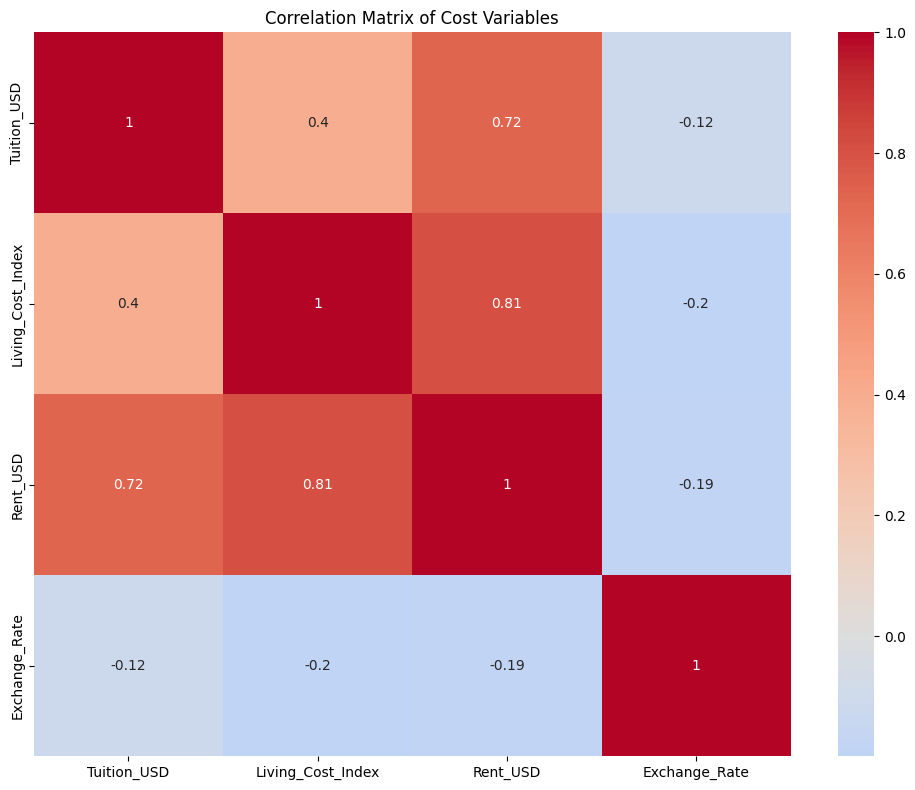

# Frank Brown - EduSpend Analysis

## Overview
This folder contains my contribution to the **EduSpend: Global Higher-Education Cost Analytics & Planning** project. I'm focusing on exploratory data analysis (EDA) to understand the factors affecting international education costs.

## Files
- `01_EDA_EduSpend.ipynb` - Main Jupyter notebook containing the exploratory data analysis
- `data/` - Directory containing the dataset files
- `README.md` - This documentation file

## Analysis Approach

### 1. Data Loading and Initial Exploration
- Loaded the International Education Costs dataset
- Performed initial data inspection (shape, data types, missing values)
- Generated summary statistics to understand the data distribution

### 2. Cost Distribution Analysis by Geographic and Academic Factors
- **Country Analysis**: Examined tuition distribution across top 10 countries by data volume
- **City Analysis**: Analyzed tuition patterns in major cities
- **Education Level**: Explored cost differences between undergraduate, graduate, and other levels
- **Program Analysis**: Investigated tuition variation across different academic programs

### 3. Visualization Strategy
- Used boxplots for initial distribution analysis
- Implemented violin plots with median annotations to better show skew and distribution shape
- Applied color-coded palettes for better visual distinction
- Focused on identifying outliers and understanding cost patterns

## Key Findings (Work in Progress)

### Geographic Patterns
- [To be completed as analysis progresses]

### Cost Structure Insights
- [To be completed as analysis progresses]
- Rent, Living Cost, and Tuition form a cluster of interrelated cost variables. Places with higher tuition tend to have higher rent (.72). Rent increases as Living Cost increases (.81)

### Outlier Detection
- [To be completed as analysis progresses]

## Next Steps

### Immediate Tasks
1. **Complete EDA Objectives**:
   - Correlation analysis between cost variables
   - Total Cost of Attendance (TCA) calculation and analysis
   - Outlier detection and assessment
   - Currency conversion stability analysis

2. **Improve Visualizations**:
   - Fix seaborn deprecation warnings
   - Add more comprehensive distribution plots
   - Create interactive visualizations using Plotly

3. **Feature Engineering Preparation**:
   - Identify key features for modeling
   - Plan encoding strategies for categorical variables
   - Design derived features for cost analysis

### Phase 2 Preparation
- Set up MLflow for experiment tracking
- Plan model development pipeline
- Design evaluation metrics for regression and classification tasks

## Technical Environment
- **Python Version**: 3.x
- **Key Libraries**: pandas, numpy, matplotlib, seaborn, plotly, scikit-learn
- **Virtual Environment**: Manually configured venv
- **IDE**: Cursor with Jupyter notebook support

## Data Source
Dataset: [International Education Costs](https://www.kaggle.com/datasets/adilshamim8/cost-of-international-education)
- Contains 907 records with 12 features
- Covers tuition, living costs, rent, visa fees, and insurance across multiple countries

## Contact
For questions about this analysis, please reach out through the project's contribution channels.

---
*Last Updated: [Current Date]*
*Project Phase: 1 - EDA*
